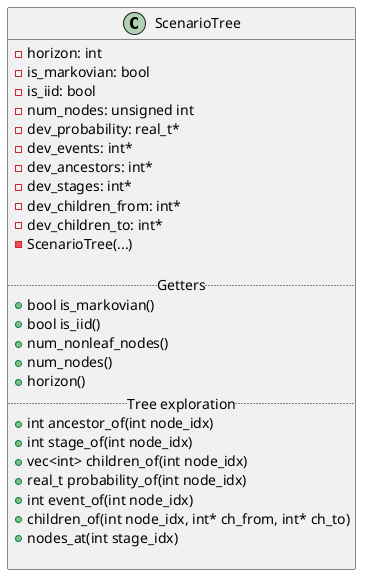
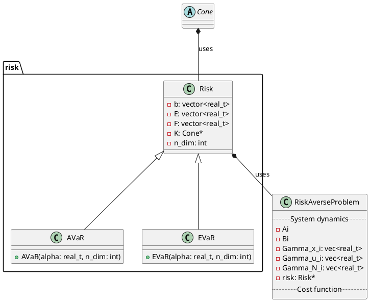
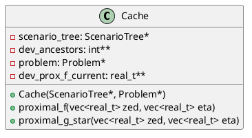

## Preliminaries

CUDA functions return error messages. We can handle these using the following

```c++
#define gpuErrchk(ans) { gpuAssert((ans), __FILE__, __LINE__); }

inline void gpuAssert(cudaError_t code, 
					  const char *file, 
					  int line, 
					  bool abort=true) {
   if (code != cudaSuccess) {
      fprintf(stderr,"GPUassert: %s %s %d\n", 
        cudaGetErrorString(code), file, line);
      if (abort) exit(code);
   }
}
```

The following will also be convenient

```c++
#define H2D cudaMemcpyHostToDevice
#define D2H cudaMemcpyDeviceToHost
```

so that we don't have to write those lengthy variables all the time.
## Classes

### Scenario tree

The `ScenarioTree` class contains only device-based memory. Note that it has a private constructor with all its attributes. All primitives are host-based. 

Note that if we want (or, perhaps, only for testing purposes) we can have pairs of host-based and device-based data and we can have methods like `transfer` .



Here is a preliminary implementation of `ScenarioTree`. The complete code can be found on the server and [here](https://gist.github.com/alphaville/65dc49b746f9e6f0b401a5dc87c0960c).

```c++
class ScenarioTree 
{
	
	private:
		int *md_ancestors = 0;  /**< (Device pointer) ancestor indices */
		int *md_stages = 0;     /**< (Device pointer) stages */
		int* md_childFrom = 0;
		int* md_childTo = 0;
		size_t m_numNodes = 0;  /**< number of nodes, incl. root node */
		size_t m_numNonleafNodes = 0; /**< number of nonleaf nodes */
		
		
		/** Allocates memory for tree on GPU */
		void allocateDeviceMemory() 
		{
			size_t nodesBytes = m_numNodes * sizeof(int);
			size_t nonleafNodesBytes = m_numNonleafNodes * sizeof(int);
			gpuErrchk( cudaMalloc((void**)&md_ancestors, nodesBytes) );
			gpuErrchk( cudaMalloc((void**)&md_stages, nodesBytes) );
			gpuErrchk( 
				cudaMalloc((void**)&md_childFrom, nonleafNodesBytes) );
			gpuErrchk( 
				cudaMalloc((void**)&md_childTo, nonleafNodesBytes) );
		}
		
		/** Transfer data to device */
		void transferIntDataToDevice(
				const rapidjson::Value& jsonArray, int* devPtr)
		{
		  size_t arrayLen = jsonArray.Size();
		  std::vector<int> hostData(arrayLen);
		  size_t numBytes = arrayLen * sizeof(int);
		  for (rapidjson::SizeType i = 0; i < arrayLen; i++) {
		  	hostData[i] = jsonArray[i].GetInt();
		  }
		  gpuErrchk( cudaMemcpy(devPtr, hostData.data(), numBytes, H2D) );
		}
		
		
	public:
			
		/**
		 * Constructor from file stream
		 */
		ScenarioTree(std::ifstream& file)
		{
		  std::string json((std::istreambuf_iterator<char>(file)), 
		                    std::istreambuf_iterator<char>()); 
		  rapidjson::Document doc;
		  doc.Parse(json.c_str()); 
		  
		  if (doc.HasParseError())
		      throw std::invalid_argument("Cannot parse JSON file");
		  
		  const rapidjson::Value& ancestorsJson = doc["ancestors"];
		  const rapidjson::Value& childFromJson = doc["children_from"];
		  m_numNodes = ancestorsJson.Size();
		  m_numNonleafNodes = childFromJson.Size();
		  
		  allocateDeviceMemory();
		  
		  /* Transfer data to device */
		  transferIntDataToDevice(ancestorsJson, md_ancestors); 
		  transferIntDataToDevice(doc["stages"], md_stages);
		  transferIntDataToDevice(childFromJson, md_childFrom);
		  transferIntDataToDevice(doc["children_to"], md_childTo);
	    }
    
    
		/**
		 * Destructor
		 */
		~ScenarioTree(){
			if (md_ancestors != 0)
				gpuErrchk( cudaFree(md_ancestors) );
			if (md_stages != 0)
				gpuErrchk( cudaFree(md_stages) );
			if (md_childFrom != 0)
				gpuErrchk( cudaFree(md_childFrom) );
			if (md_childTo != 0)
				gpuErrchk( cudaFree(md_childTo) );			
		}
			
		
		int* ancestorsDevPtr() {
			return md_ancestors;
		}
		
		int* stagesDevPtr() {
			return md_stages;
		}	
};
```

Scenario trees can be stored in JSON files. For example,

```json
{
	"stages":        [0, 1, 1, 2, 2, 2, 2, 3, 3, 3, 3, 3, 3, 3, 3],
	"ancestors":     [0, 0, 0, 1, 1, 2, 2, 3, 3, 4, 4, 5, 5, 6, 6],
	"events":        [0, 0, 1, 0, 1, 0, 1, 0, 1, 0, 1, 0, 1, 0, 1],
	"probabilities": [1.0, 0.5, 0.5, 0.25, 0.25, 0.25, 0.25, 0.125, 0.125, 0.125, 0.125, 0.125, 0.125, 0.125, 0.125]
}
```

Let us not create a scenario tree factory for simplicity. We can have multiple constructors if need be.

> [!note] Just a thought
> Actually, it may not be be too bad an idea, only for the scenario tree to have the data both on the host and on the device. I suspect we'll use them on both. The thing is that the operations on the device are orchestrated by the host. E.g, the host will need to know all the nodes at stage $k$ to instruct the device to parallelise certain operations. In any case, the above pattern can be re-used in other classes. For example, in the problem class we'll have to read data from a JSON file and transfer it to the device.

### Problem



Note that a the definition of a risk depends on the definition of `Cone`, which is an abstract class. We will need different types of cones such as positive orthants and second-order cones.

```plantuml
package cones {
	abstract class Cone {
	 {abstract} void project(float* dev_x) 
	 {abstract} void project_dual(float* dev_x) 
	}
	
	class SOC {
	
	 
	}
	
	class PositiveOrthant {
	 -n: int
	 +PositiveOrthant(int n);
	
	 +void project(float* dev_x)
	 +void project_dual(float* dev_x) 
	}
	
	Cone <|-- SOC
	Cone <|-- PositiveOrthant
}
```

Here is a minimal implementation of the abstract class `Cone` and the derived class `PositiveOrthant`:

```c++
__global__ void project_positive_orthant(float* x, int n)
{
	int i = blockIdx.x*blockDim.x + threadIdx.x;
	if (i<n and x[i] < 0) {
		x[i] = 0.;
	}
}


class Cone {
	public:
		virtual void project(float* dev_x)  =0;
		virtual void project_dual(float* dev_x)  =0;
};


class PositiveOrthant : public Cone
{
	private:
		int m_dimension;
	 
	public:
	
		PositiveOrthant(int n) {
			m_dimension = n;
		};
		
		
		virtual ~PositiveOrthant() =default;
    
    void project(float* dev_x) {
    	project_positive_orthant<<<m_dimension, 1>>>(dev_x, m_dimension);
    } 
    
    void project_dual(float* dev_x) {
			project(dev_x);
    }
    
}; 
```

Note that the kernel `project_positive_orthant` is defined outside the class (it is not a class member). This is because we can't have `__global__` functions inside a class, but we can have `__host__ __device__` functions if we like (which can serve as auxiliary functions for kernels).
### Cache



### Overall 

```plantuml

!theme vibrant

  
abstract host.python_api {

+generate_data()

+matplotlib()

+tikz()

}

abstract host.cpp_api {

+NOT USED YET

}

  

interface host.json.data

interface host.json.result

  

class host.ScenarioTree {

}

  

class host.ProblemData {

   +A: vec<int>

   +B: vec<int>

   +L: vec<int>

}

  

class host.Cache {

+prim: vec<int>

+dual: vec<int>

}

  

interface host.HostMemory {

+Cache_h: ptr

}

  

interface device.DeviceMemory {

+Cache_d: ptr

}

  

class device.Engine {

+solution: vec<int>

}

  

host.python_api --> host.json.data

host.cpp_api --> host.ScenarioTree

host.cpp_api --> host.ProblemData

  

host.json.data --> host.ScenarioTree

host.json.data --> host.ProblemData

  

host.ScenarioTree --> host.Cache

host.ProblemData --> host.Cache

  

host.Cache <--> host.HostMemory

host.HostMemory <--> device.DeviceMemory

device.DeviceMemory <--> device.Engine

  

host.Cache --> host.json.result : "testing"

host.json.result --> host.python_api : "testing"

  

@enduml

```
