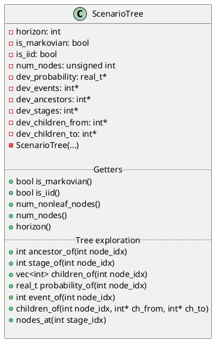
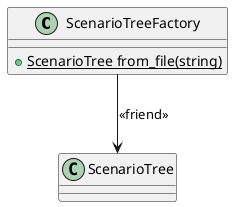
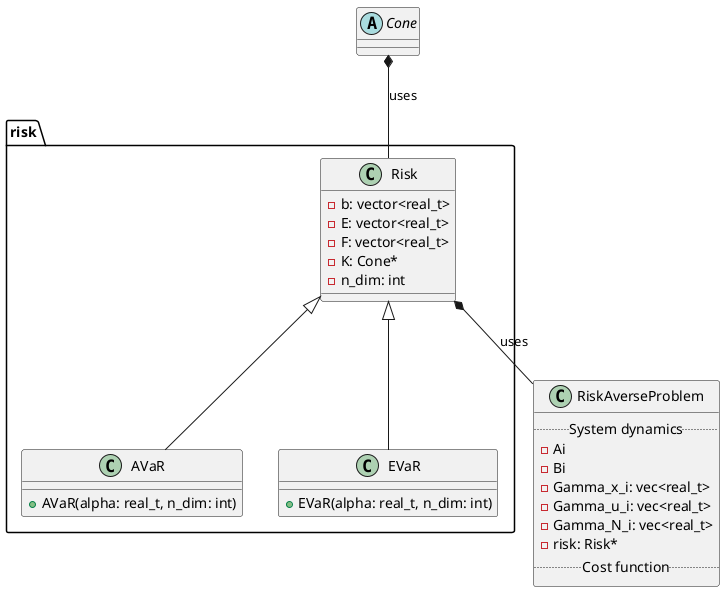
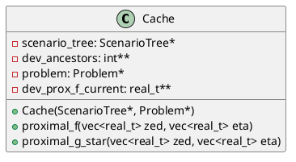

## Preliminaries

CUDA functions return error messages. We can handle these using the following

```c++
#define gpuErrchk(ans) { gpuAssert((ans), __FILE__, __LINE__); }

inline void gpuAssert(cudaError_t code, 
					  const char *file, 
					  int line, 
					  bool abort=true) {
   if (code != cudaSuccess) {
      fprintf(stderr,"GPUassert: %s %s %d\n", 
        cudaGetErrorString(code), file, line);
      if (abort) exit(code);
   }
}
```

The following will also be convenient

```c++
#define H2D cudaMemcpyHostToDevice
#define D2H cudaMemcpyDeviceToHost
```

so that we don't have to write those lengthy variables all the time.
## Classes

### Scenario tree

The `ScenarioTree` class contains only device-based memory. Note that it has a private constructor with all its attributes. All primitives are host-based. 

Note that if we want (or, perhaps, only for testing purposes) we can have pairs of host-based and device-based data and we can have methods like `transfer



Here is a preliminary implementation (not using any private members for simplicity):

```c++
class ScenarioTree {
	public:
		int *dev_ancestors = 0;
		
		/**
		 * Constructor of ScenarioTree
		 */
		ScenarioTree(std::vector<int>* ancestors) {
			int numAncestors = ancestors->size();
			// allocate memory for ancestors
			size_t ancestorsBytes = numAncestors * sizeof(int);
			gpuErrchk(
				cudaMalloc(
					(void**)&dev_ancestors, 
					ancestorsBytes)  );
			gpuErrchk(
				cudaMemcpy(dev_ancestors, 
					ancestors->data(), ancestorsBytes, H2D)  );
		}
		
		/**
		 * Destructor
		 */
		~ScenarioTree(){
			if (dev_ancestors != 0) {
				gpuErrchk( cudaFree(dev_ancestors) );
			}
			dev_ancestors = 0;
		}
		
};
```

There is also a `ScenarioTreeFactory` which can be used to construct scenario trees. One of its methods will allow the construction of scenario trees from JSON files, which will be generated from Python. Other ways to generate trees can be added in the future.



### Problem



Note that a the definition of a risk depends on the definition of `Cone`, which is an abstract class. We will need different types of cones such as positive orthants and second-order cones.

```plantuml
package cones {
	abstract class Cone {
	 {abstract} void project(float* dev_x) 
	 {abstract} void project_dual(float* dev_x) 
	}
	
	class SOC {
	
	 
	}
	
	class PositiveOrthant {
	 -n: int
	 +PositiveOrthant(int n);
	
	 +void project(float* dev_x)
	 +void project_dual(float* dev_x) 
	}
	
	Cone <|-- SOC
	Cone <|-- PositiveOrthant
}
```

Here is a minimal implementation of the abstract class `Cone` and the derived class `PositiveOrthant`:

```c++
__global__ void project_positive_orthant(float* x, int n)
{
	int i = blockIdx.x*blockDim.x + threadIdx.x;
	if (i<n and x[i] < 0) {
		x[i] = 0.;
	}
}


class Cone {
	public:
		virtual void project(float* dev_x)  =0;
		virtual void project_dual(float* dev_x)  =0;
};


class PositiveOrthant : public Cone
{
	private:
		int m_dimension;
	 
	public:
	
		PositiveOrthant(int n) {
			m_dimension = n;
		};
		
		
		virtual ~PositiveOrthant() =default;
    
    void project(float* dev_x) {
    	project_positive_orthant<<<m_dimension, 1>>>(dev_x, m_dimension);
    } 
    
    void project_dual(float* dev_x) {
			project(dev_x);
    }
    
}; 
```

Note that the kernel `project_positive_orthant` is defined outside the class (it is not a class member). This is because we can't have `__global__` functions inside a class, but we can have `__host__ __device__` functions if we like (which can serve as auxiliary functions for kernels).
### Cache



### Overall 

```plantuml

!theme vibrant

  
abstract host.python_api {

+generate_data()

+matplotlib()

+tikz()

}

abstract host.cpp_api {

+NOT USED YET

}

  

interface host.json.data

interface host.json.result

  

class host.ScenarioTree {

}

  

class host.ProblemData {

   +A: vec<int>

   +B: vec<int>

   +L: vec<int>

}

  

class host.Cache {

+prim: vec<int>

+dual: vec<int>

}

  

interface host.HostMemory {

+Cache_h: ptr

}

  

interface device.DeviceMemory {

+Cache_d: ptr

}

  

class device.Engine {

+solution: vec<int>

}

  

host.python_api --> host.json.data

host.cpp_api --> host.ScenarioTree

host.cpp_api --> host.ProblemData

  

host.json.data --> host.ScenarioTree

host.json.data --> host.ProblemData

  

host.ScenarioTree --> host.Cache

host.ProblemData --> host.Cache

  

host.Cache <--> host.HostMemory

host.HostMemory <--> device.DeviceMemory

device.DeviceMemory <--> device.Engine

  

host.Cache --> host.json.result : "testing"

host.json.result --> host.python_api : "testing"

  

@enduml

```
